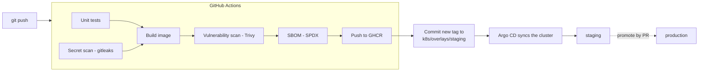

# gitops-platform

A small service shipped the way production platforms ship it: **containerized, tested and scanned in CI, and deployed to Kubernetes through GitOps**.

The app is deliberately tiny. The point of this repo is the delivery path around it: health probes, graceful shutdown, zero-downtime rollouts, per-environment config with Kustomize, image scanning, SBOMs, and Git as the only way to change what runs.

> Personal learning project, built with Claude Code as a pair programmer. Every design decision is written down below, and I can explain each one.

---

## Delivery flow



CI never talks to the cluster. It only **commits the new image tag to Git**. The GitOps controller pulls that change and reconciles the cluster, so Git is the single source of truth and every deploy is a reviewable, revertible commit.

---

## Repository layout

```
app/                      Node.js API + Dockerfile + tests
k8s/base/                 Deployment, Service, Ingress, HPA, PodDisruptionBudget
k8s/overlays/staging/     1–2 replicas, staging host, image tag written by CI
k8s/overlays/production/  3–6 replicas, production host, tag changed only by PR
.github/workflows/ci.yml  test → scan → build → push → promote to staging
```

---

## Design decisions

### The app
- **Liveness vs readiness.** `/healthz` answers "is the process alive?", so a failure restarts the container. `/readyz` answers "should I get traffic right now?", so a failure only removes the pod from the Service. Liveness doesn't check dependencies: a database outage shouldn't restart every pod.
- **Graceful shutdown.** On `SIGTERM` the app fails readiness, waits 5 s for Kubernetes to stop routing to it, finishes in-flight requests, then exits. The drain time stays below `terminationGracePeriodSeconds` (30 s).
- **Structured logs.** One JSON object per line with `severity` and `message`, which Cloud Logging parses natively.
- **Metrics.** Prometheus format on `/metrics`. Request labels use the route *pattern*, not the raw URL, so label cardinality stays bounded.

### The image
- **Multi-stage build** with `npm ci --omit=dev`: reproducible installs, no dev dependencies in the final image.
- **Runs as UID 1000, not root.** The UID is numeric so Kubernetes' `runAsNonRoot` can verify it.
- **npm, npx, yarn and corepack are removed** from the runtime image. They aren't needed at runtime, and removing them also removes their dependencies from the attack surface and from scan results.
- **`CMD ["node", ...]`, not `npm start`**, so `SIGTERM` reaches the app's handler directly.
- **Immutable tags** (`sha-<commit>`): every image maps to exactly one commit, and nothing is ever deployed as `latest`.

### Kubernetes
- **`maxUnavailable: 0`, `maxSurge: 1`**: a rollout adds a new pod, waits for it to be ready, and only then removes an old one, so capacity never drops.
- **No `replicas` in the Deployment.** The HPA owns the replica count; if Git set it too, the GitOps controller and the HPA would keep overwriting each other.
- **Memory limit, no CPU limit.** Exceeding memory is unsafe, so the container is OOM-killed and restarted. A CPU limit would throttle the app even when the node has idle CPU, so only a CPU *request* is set (which the HPA's 70% target is measured against).
- **PodDisruptionBudget**: node drains and upgrades keep at least one pod serving in production. Staging runs a single replica, so its PDB is relaxed to avoid blocking drains.
- **Hardened pod**: non-root, read-only root filesystem, all Linux capabilities dropped, no privilege escalation, default seccomp profile.

### CI (GitHub Actions)
- **Least-privilege token**: `contents: read` by default; only the build job gets `packages: write`, and only the promotion job gets `contents: write`.
- **Scan before push**: the image is built and loaded locally, scanned with Trivy (fails on fixable HIGH/CRITICAL), and only then pushed. Pull requests build and scan but never push.
- **Supply chain**: gitleaks scans the full Git history for committed secrets, and an SPDX SBOM is generated for every image and kept as a build artifact.

---

## Run it

```bash
cd app
npm ci
npm test
docker build -t hello-api:dev --build-arg APP_VERSION=dev .
docker run --rm -p 8080:8080 hello-api:dev
curl localhost:8080/api/version
```

Render the Kubernetes manifests for an environment:

```bash
kubectl kustomize k8s/overlays/staging
kubectl kustomize k8s/overlays/production
```

---

## Status and roadmap

**Done:** app with probes, graceful shutdown, logs and metrics · hardened multi-stage image · Kustomize base and two overlays · CI with tests, secret scan, vulnerability scan, SBOM, push to GHCR and automatic promotion to staging.

**Next:**
- [ ] Local cluster with kind + ingress-nginx + metrics-server, and Argo CD applications for staging and production
- [ ] "Promote to production" workflow that opens a pull request with the tag already verified in staging
- [ ] Terraform for Google Cloud: Artifact Registry, GKE Autopilot, Workload Identity Federation for GitHub Actions (no service-account keys), least-privilege IAM, Secret Manager and a budget alert
- [ ] Runbooks (failed rollout, CrashLoopBackOff) and a backup/restore drill
